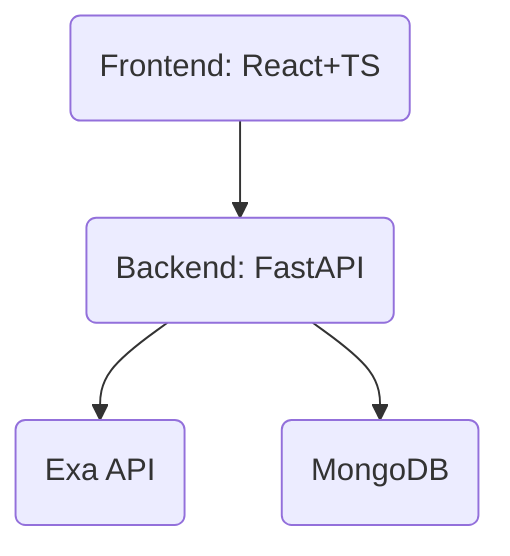

# 🔍 AI-Powered Semantic Search Engine


A full-stack AI-powered semantic search application that allows users to search the web using natural language queries.
The backend integrates an LLM-based search API (Exa), while the frontend provides a clean, public-first search experience with optional authentication for user-specific features.

---

## 🚀 Features

- 🔎 Semantic search using natural language
- 🧠 LLM-powered relevance via Exa API
- 🌐 Public search (no login required)
- 🔐 Optional authentication (JWT) for saving search history
- 📜 User search history persisted in MongoDB
- ⚡ FastAPI async backend
- ⚛️ React + TypeScript frontend
- ☁️ Cloud-ready (MongoDB Atlas, stateless backend)

---

## 🏗️ Architecture Overview



---

## 🧑‍💻 Tech Stack

**Backend:**
- FastAPI
- MongoDB (Motor – async)
- JWT Authentication
- Exa AI Search API

**Frontend:**
- React
- TypeScript
- Vite

---

## 📦 Project Structure

```text
backend/
├── app/
│   ├── api/        # API routes (auth, search, history)
│   ├── services/   # External integrations (Exa)
│   ├── schemas/    # Request/response validation
│   ├── core/       # Config & security
│   └── db/         # MongoDB connection
frontend/
├── src/
│   ├── pages/
│   ├── components/
│   ├── api/
│   └── hooks/
```

---

## ⚙️ Setup Instructions

### 1️⃣ Backend Setup

```bash
cd backend
python -m venv venv
# On Windows:
venv\Scripts\Activate.ps1
# On macOS/Linux:
source venv/bin/activate
pip install -r requirements.txt
```

Create `.env` using `.env.example`.

Run backend:

```bash
uvicorn app.main:app --reload
```

Backend runs at: [http://localhost:8000](http://localhost:8000)

### 2️⃣ Frontend Setup

```bash
cd frontend
npm install
npm run dev
```

Frontend runs at: [http://localhost:5173](http://localhost:5173)

---

## 🧪 API Testing

- Swagger UI: [http://localhost:8000/docs](http://localhost:8000/docs)

**Test flow:**
- Register / Login
- Perform search (public or authenticated)
- View saved history (authenticated users)

---

## 🔐 Authentication Behavior

- Search works without login
- Login enables search history persistence
- JWT is stored client-side and sent via Authorization header

---

## 🧠 What This Project Demonstrates

- Real-world AI integration (LLM APIs)
- Clean backend architecture
- API contract enforcement
- Optional authentication design
- Frontend–backend integration
- Defensive error handling

---

## 📌 Future Improvements

- Pagination for search results
- Rate limiting
- UI polish & loading states
- Deployment to Vercel / Railway